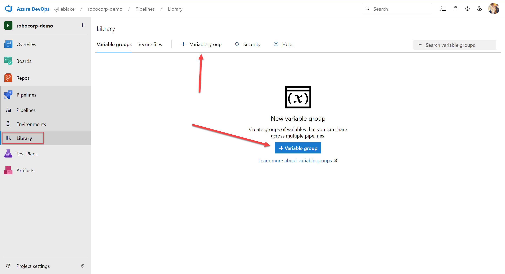
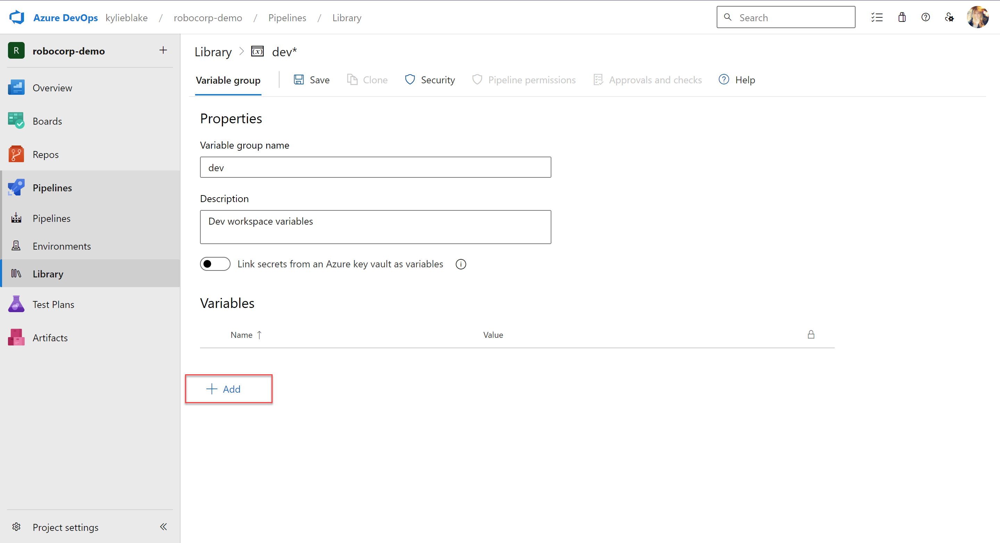
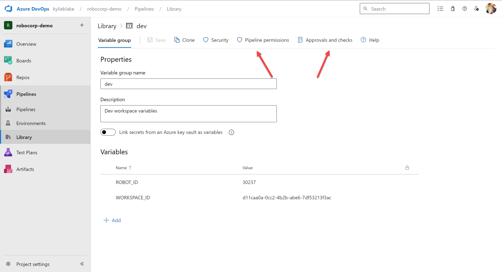
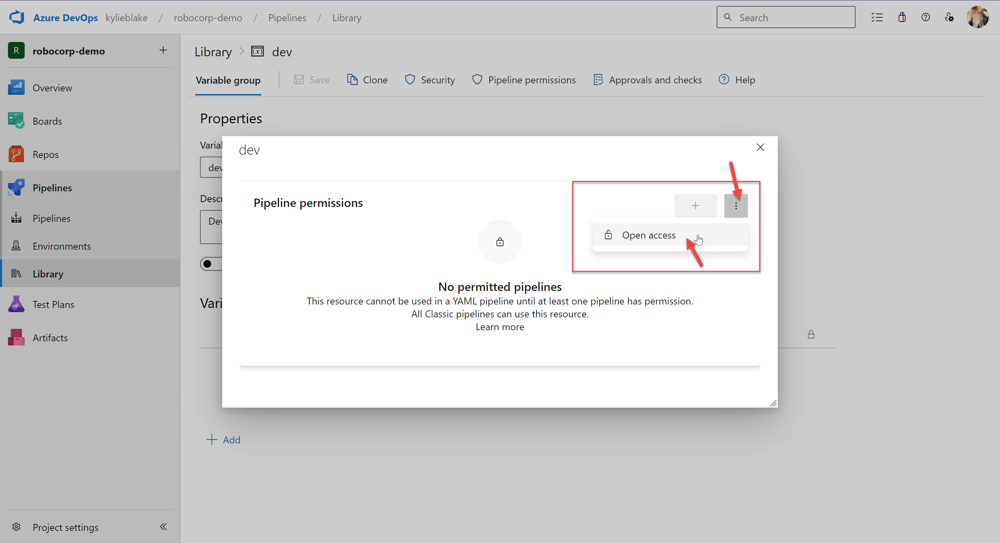
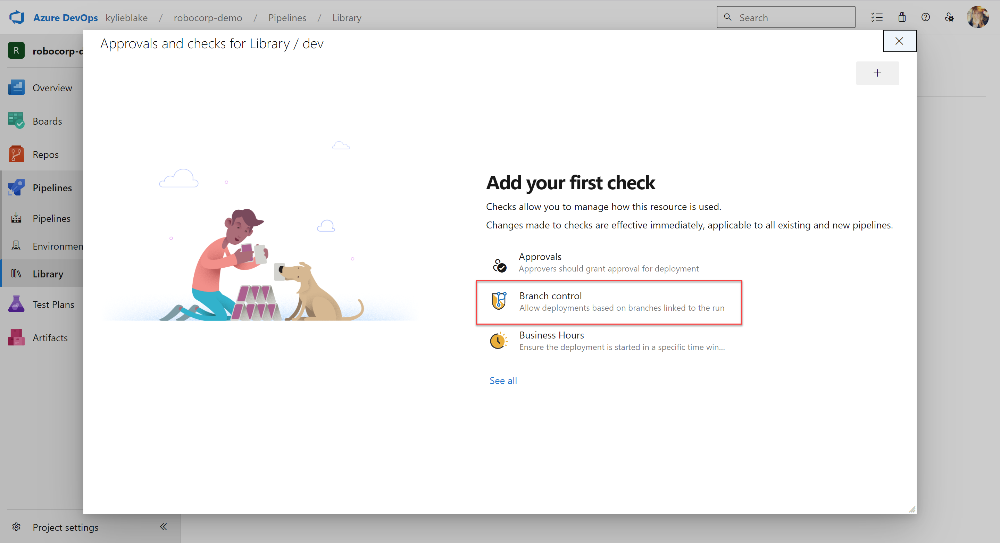
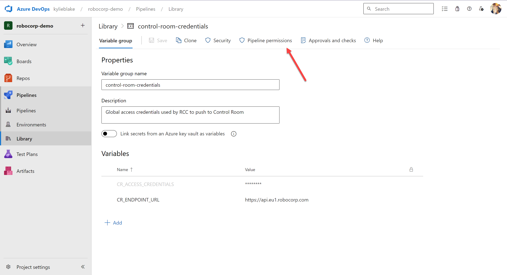
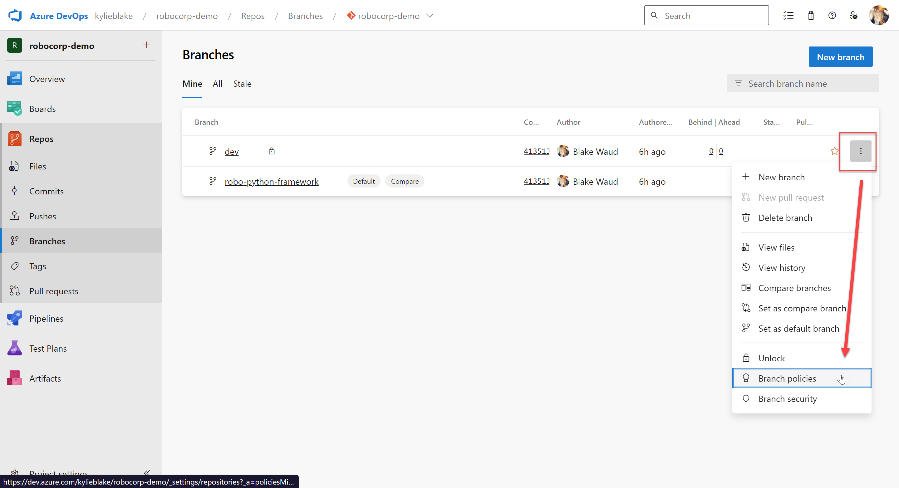
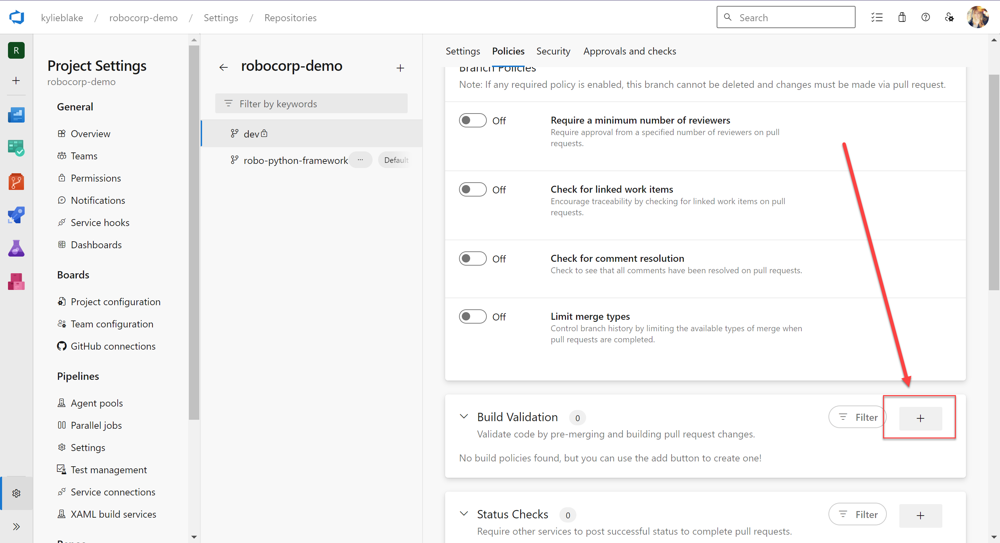
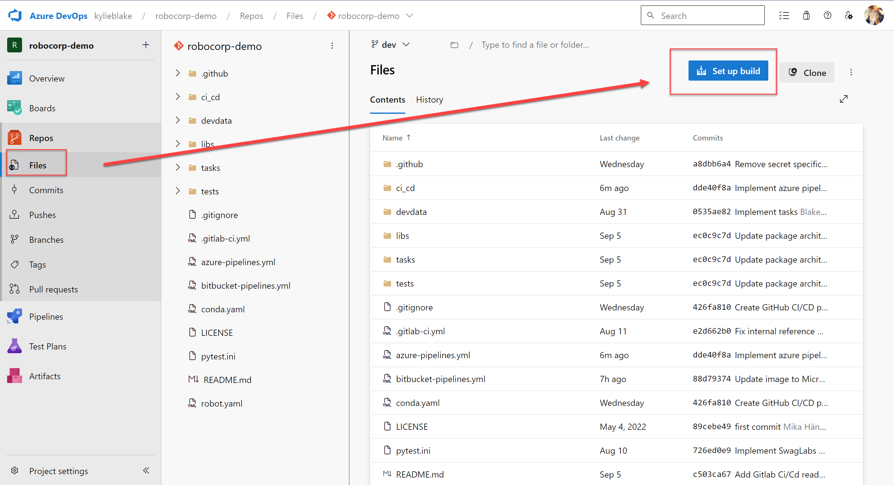
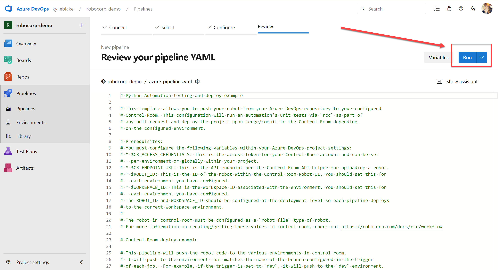

# Azure DevOps Pipeline for Python-based Automations

This section of the example explains how to setup a Azure DevOps pipeline which will run your unit tests when Pull Requests are opened against the `main`, `test`, and `dev` branches. There is also a pipeline file which can deploy to Control Room. This readme describes how you would set up your environments within Azure DevOps to automatically utilize the correct pipeline and workspace within Control Room.

This readme assumes the following:

* A Robocorp Control Room Organization exists with three different workspaces with the following names:
    * `Production`: which we will link with the `main` branch
    * `Test`: which we will link with the `test` branch
    * `Dev`: which we will link with the `dev` branch
* An Ubuntu-based runner exists within your Azure DevOps instance which can execute the script
* A Azure DevOps Project and corresponding respository with the following branches, all set to be protected:
    * `main`
    * `test`
    * `dev`

## Creating Variable Groups

### Creating workspace/branch groups

Before you can configure pipelines to use different variables for each branch, you must first create corresponding variable groups. You do this within your Azure DevOps repository by navigating to the `Pipelines` > `Library` menu, then clicking the `+ Variable group` button.

If you already have variable groups in your repo, the button is above the existing groups, otherwise, it will be in the middle of your screen.

Set the name for the variable group as one of `dev`, `test`, or `main`. For this pipeline file, the name needs to match the protected branches you will be deploying from. The add the `ROBOT_ID` and `WORKSPACE_ID` variables to the group that correspond to the appropriate robot and workspace within Control Room. These variables do not need to locked.

Then you must set `Pipeline permissions` and `Approvals and checks`. The goal is to allow any pipeline to use the group, but restrict these variables to only be available to pipelines running on the corresponding branch that matches it's name.

Opening access removes the requirement that you approve every new pipeline using the variable group.

> **IMPORTANT** If you are working in a large collaborative environment, you may want to consider not setting open access depending on your own security stance.

When configuring branch control, remember to define the branch name like `refs/heads/dev` and `refs/heads/main` per the Azure DevOps requirements.

### Creating global access credential group

You must also create a single globally accessible group which contains the access credentials that allow `rcc` to push to the Control Room.

For this group, you can configure `Open access` but you do not need to create and `checks`, but again, consider your own group security in case you'd rather not set `Open access`. If you want, you could configure this global group to be restricted to the three deploying branches by setting up a branch control with the branch name pattern of: `refs/heads/dev,refs/heads/test,refs/heads/main`.

## Setting up Pull Request Builds

Azure DevOps is unique in that you cannot define pull request triggers within the YAML pipeline specification files. You must do so within the branch policies. Branch policies are associated with each branch, hit the `...` button on the branch to access them.

> **Note** You cannot create `Build Validation` policies until you have created `Build Definitions`, which is to say, your pipeline file needs to be within the branch you are setting up. If you have not setup your build, skip down to the [Setting up your build](#setting-up-your-build) section.

You must add a `Build Validation` type of policy.

You should create a policy that immediately runs the pipeline whenever a the branch is updated. You should also set the build as required.

## Setting up your build

Azure DevOps requires that you not only define your pipeline within the YAML file, but you also must configure your builds to actually have them run. You can do so from the the `Files` view on any specific branch. You can only do this once the branch in question has your pipeline file in it (e.g., you have merged it in already).

Once you click this and your already have the file in your repo, it will jump to the verify and run step.

By clicking `Run`, the system will create the Pipeline and attempt to execute your Pipeline file.

