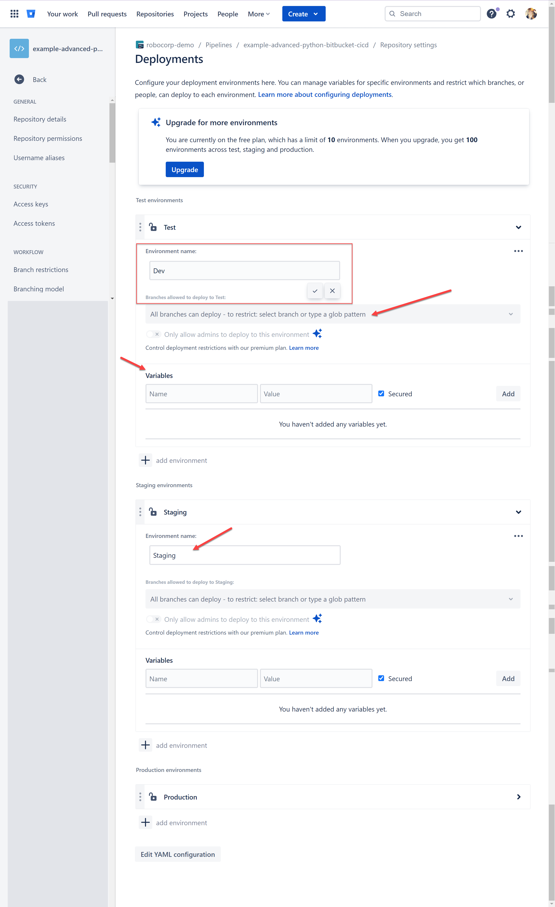
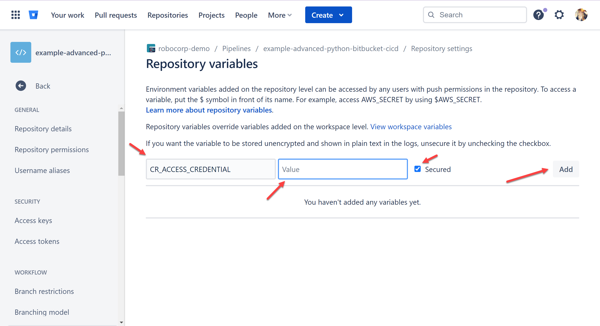

# Bitbucket Pipeline for Python-based Automations

This section of the example explains how to setup a Bitbucket pipeline which will run your unit tests when Pull Requests are opened against the `main`, `test`, and `dev` branches. There is also a pipeline file which can deploy to Control Room. This readme describes how you would set up your environments within Bitbucket to automatically utilize the correct pipeline and workspace within Control Room.

This readme assumes the following:

* A Robocorp Control Room Organization exists with three different workspaces with the following names:
    * `Production`: which we will link with the `main` branch
    * `Test`: which we will link with the `test` branch
    * `Dev`: which we will link with the `dev` branch
* An Ubuntu-based runner exists within your Bitbucket instance which can execute the script
* A BitBucket repository with the following branches, all set to be protected:
    * `main`
    * `test`
    * `dev`
* Pipelines are enabled for your repository

## Creating environments

Before you can configure pipelines to use different variables for each branch, you must first create corresponding deployments. You do this within your BitBucket repository by navigating to the `Repository settings` > `Deployments` menu. BitBucket populates this section automatically with three Deployments called `Test`, `Staging`, and `Production`. You can rename them easily to match your desired names.

> **NOTE** If you are on a premium plan, you can also configure the deployment to only allow deployment from your mapped branch, e.g., the `dev` branch should deploy via the `Dev` deployment.

While you are here, you can also configure your deployment-specific variables, like `ROBOT_ID` and `WORKSPACE_ID`, neither of which need to be secured.

## Saving API keys and other variables

Once you have your three deployments, you can create variables for the access credential needed by the pipeline so you can deploy from it.

> **IMPORTANT** Be sure to make the access credential token is a `secured` variable!

Variables can be created from the `Repository settings` > `Repository variables` menu. Search through the various sections of the `CI/CD Settings` menu to find the `Variables` section, where you can add the variables.

You must add the variables as defined in the [pipeline](../../bitbucket-pipelines.yml) file (which is located in the root of the robot file due to limitations of BitBucket).

## Try running it!

Now you can try to run your new pipeline from the `Pipelines` menu! You can also trigger the pipeline by creating a merge request targeting any of the three protected branches.
