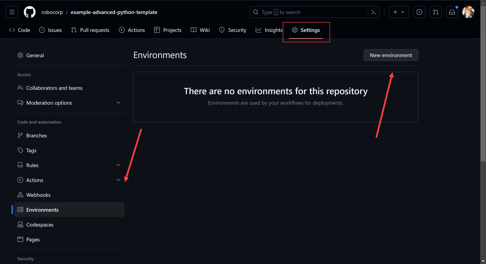
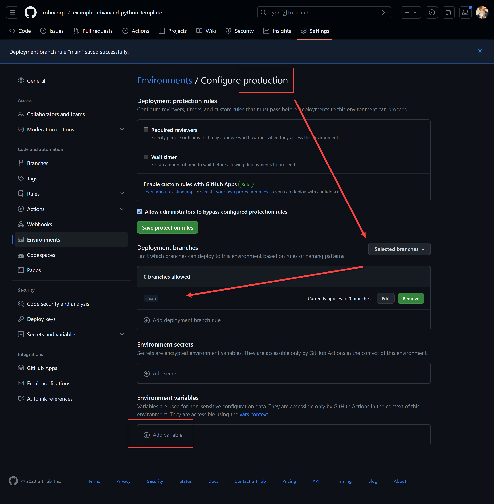
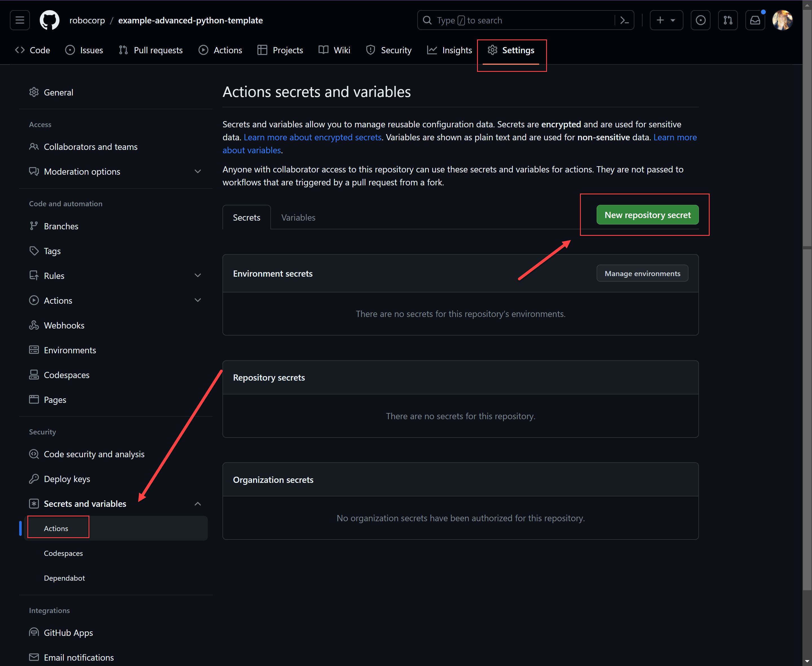
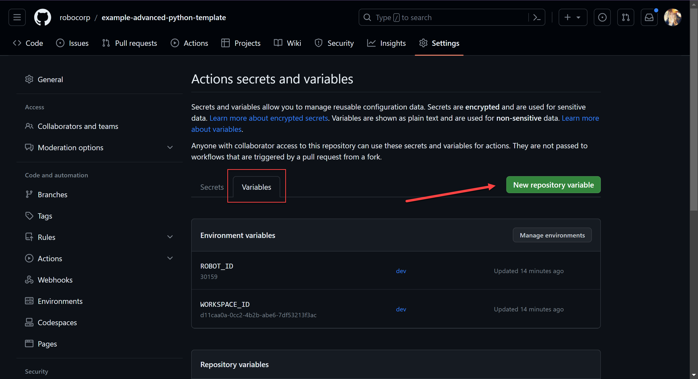

# GitHub Actions for Python-based Automations

This section of the example explains how to setup a GitHub Actions which will run your unit tests when Pull Requests are opened against the `main`, `test`, and `dev` branches. There is also an action file which can deploy to Control Room if you prefer to use that instead of the [Robocorp Control Room GitHub integration](https://robocorp.com/docs/control-room/technical-architecture-and-security/version-control). This readme describes how you would set up your variables within GitHub to automatically utilize the correct action and workspace within Control Room.

> **NOTE** Action files are stored in [`.github/workflows`](./.github/workflows) as required by GitHub.

This readme assumes the following:

* A Robocorp Control Room Organization exists with three different workspaces with the following names:
    * `Production`: which we will link with the `main` branch
    * `Test`: which we will link with the `test` branch
    * `Dev`: which we will link with the `dev` branch
* An Ubuntu-based runner exists within your GitHub instance which can execute the script
* A GitHub account and repository for your robot that has three different protected branches with the following names:
    * `main`
    * `test`
    * `dev`

## Creating environments

Before you can configure actions to use different variables for each branch, you must first create corresponding environments. You do this within your GitHub repository by navigating to the `Settings` > `Environments` menu, then clicking the `New environment` button. 

You must specificy a name before saving. In our example, we chose `dev`, `test`, and `production`. Once you've entered a name, you can click `Configure Environment` to configure settings and set variables.

When configuring the environment, you should configure the `Deployment branches` so that each environment is only deploying one specific branch, e.g., the `main` branch will deploy to the `production` environment. You should also create the environment variables `ROBOT_ID` and `WORKSPACE_ID` while you are on this screen by clicking `Add variable`.

> **NOTE** You can also set variables separately as described below.

## Saving API keys and other variables

Once you have your three environments, you can create variables for each as well as provide variables for the secret access credential token needed by the action if you are deploying from it.

> **IMPORTANT** Be sure to make the access credential token a `secret`!

Variables can be created from the `Settings` > `Secrets and variables` > `actions` menu. This menu provides for a tab to create `Secrets` and a tab to create `Variables`. If you created variables when creating your environments, you will see them in the `Variables` tab. You must add the secrets and variables as defined in the [action](../../.github/workflows/robocorp-deploy.yml) file.

Secrets will remain masked in logging.

The only repository level secret needed in the `CR_ENDPOINT_URL`. You will have configured the other variables when creating your environments.

## Try running it!

Now you can try to run your new pipeline from the `Actions` menu! You can also trigger the pipeline by creating a merge request targeting any of the three protected branches.

Example runs for these GitHub actions are part of this very repo!
