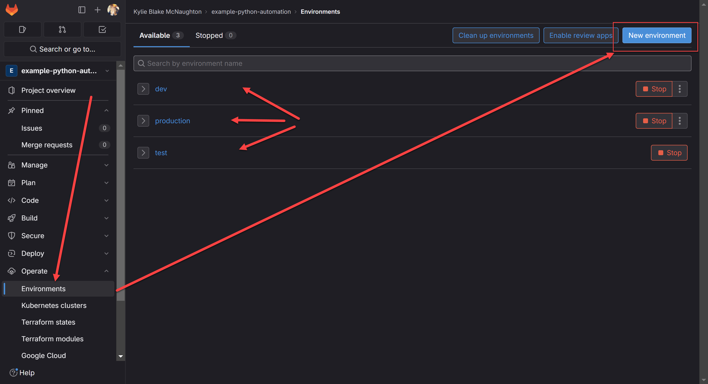
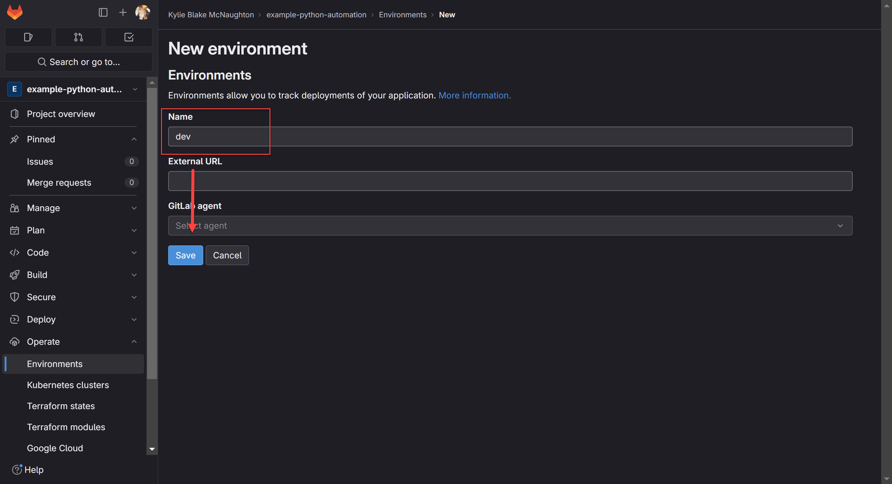
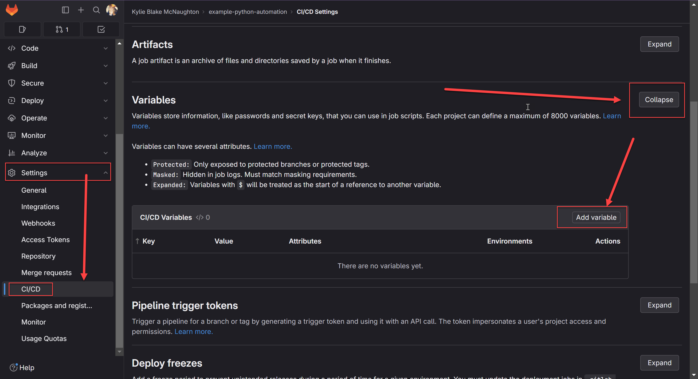
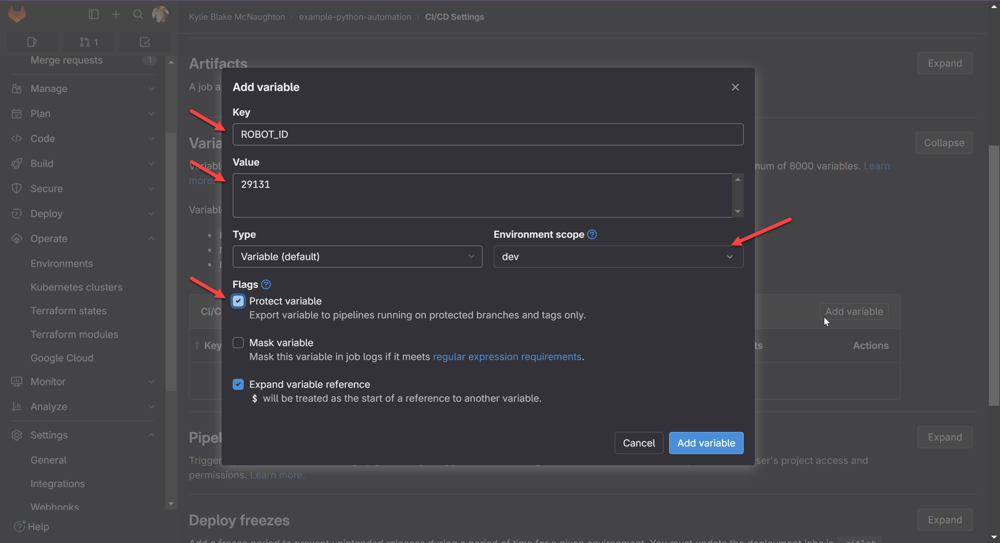
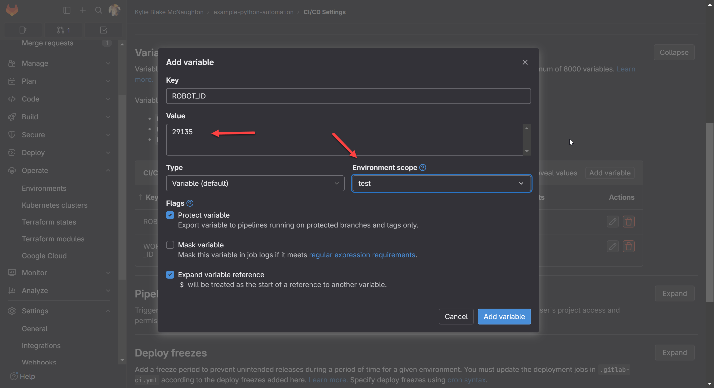

# GitLab Pipeline for Python-based Automations

This section of the example explains how to setup a GitLab pipeline which will run your unit tests when Pull Requests are opened against the `main`, `test`, and `dev` branches. There is also a pipeline which can deploy to Control Room if you prefer to use that instead of the [Robocorp Control Room GitLab integration](https://robocorp.com/docs/control-room/technical-architecture-and-security/version-control). This readme describes how you would set up your environments within GitLab to automatically utilize the correct pipeline and workspace within Control Room.

This readme assumes the following:

* A Robocorp Control Room Organization exists with three different workspaces with the following names:
    * `Production`: which we will link with the `main` branch
    * `Test`: which we will link with the `test` branch
    * `Dev`: which we will link with the `dev` branch
* An Ubuntu-based runner exists within your GitLab instance which can execute the script
* A GitLab Project and corresponding respository with the following branches, all set to be protected:
    * `main`
    * `test`
    * `dev`

## Creating environments

Before you can configure pipelines to use different variables for each branch, you must first create corresponding environments. You do this within your GitLab repository by navigating to the `Operate` > `Environments` menu, then clicking the `add` button. 

You must specificy a name before saving. In our example, we chose `dev`, `test`, and `production`.

## Saving API keys and other variables

Once you have your three environments, you can create variables for each as well as provide variables for the secret API token needed by the pipeline if you are deploying from it.

> **IMPORTANT** Be sure to make the API token a `masked` variable!

Variables can be created from the `Settings` > `CI/CD` menu. Search through the various sections of the `CI/CD Settings` menu to find the `Variables` section, where you can add the variables.

You must add the variables as defined in the [pipeline](robocorp-ci-template.gitlab-ci.yml) file.

Since you are creating different variables for each environment, you must create the same variable multiple times, setting it to be related to specific environments.

## Try running it!

Now you can try to run your new pipeline from the `Build` > `Pipeline` menu! You can also trigger the pipeline by creating a merge request targeting any of the three protected branches.
